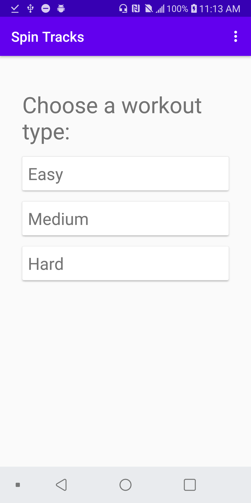
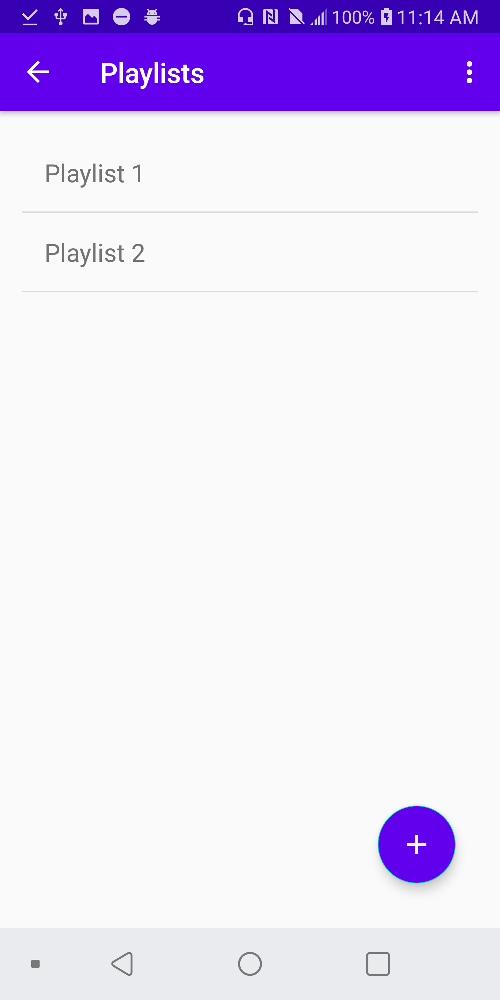
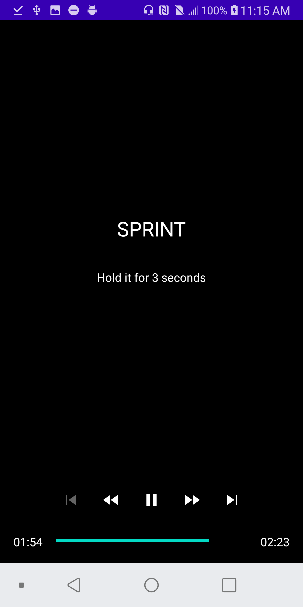

# spintracks
A simple Android app for creating spin workouts based on your local music.

## Features
* create playlists using your own music
* import local songs based on album, artist or title
* choose between different workout difficulty levels
* follow a workout sequence generated from your playlist

## Screenshots

